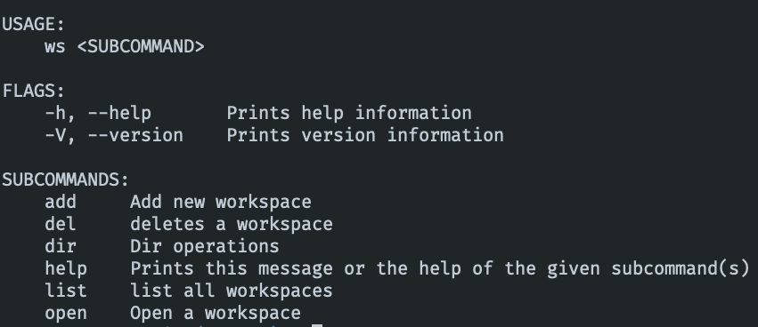

# Workspaces CLI

Simple CLI to manage workspaces locally

Add workspaces and the directories inside it to an sqlite database

## Usage

### Add current directory as workspace

`ws add -p .`

### List all workspaces

`ws list`

### Add a directory to a workspace

`ws dir --workspace [name] add -p [path]`
